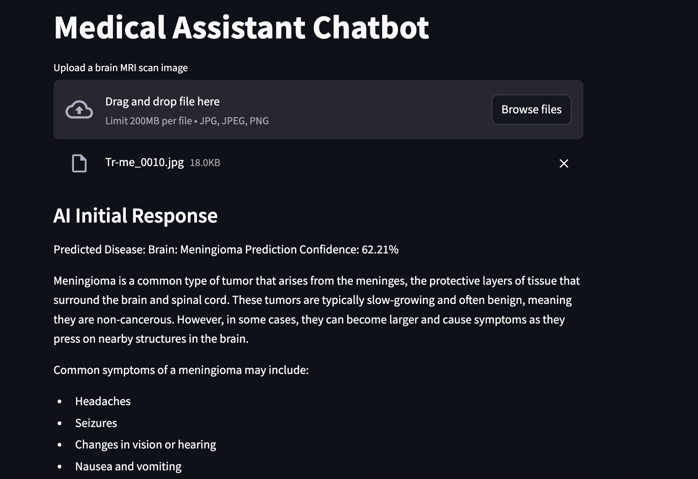
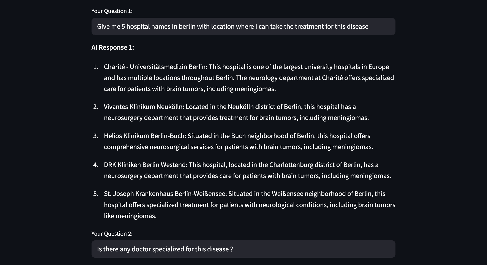

# **Medical Assistant - AI-Powered Brain Tumor Classifier & Chatbot**

This is a **fully customizable, transformer-based** medical diagnostic system designed to classify brain tumors from MRI scans and assist with interactive medical Q&A using **LLMs**.

> **"AI-Powered Brain Tumor Detection + Chatbot using Vision Transformers (ViT) & LangChain"**  
> Built by deep learning enthusiasts, this unofficial project explores the combination of **Vision Transformers (ViT)** and **LLMs (OpenAI)** for medical assistance.

## **📌 Workflow**

| **Step** | **Process**        | **Description** |
|----------|--------------------|-----------------|
| 1       | Preprocess Image   | Resize, grayscale, normalize |
| 2️       | Classify Image     | Predict tumor class using ViT |
| 3️       | Display Diagnosis  | Output tumor type & confidence |
| 4️       | Chat with AI       | Ask related medical questions |

---

## Demo Screenshots - Projects

<div align="center">
  
  
</div>

---

## **📌 Key Features**
ViT-based image classifier for brain MRI scans  
Multi-class classification: **Glioma, Meningioma, Pituitary, No Tumor**  
Integrated **LangChain + OpenAI ChatGPT** for contextual medical Q&A  
Support for **custom model training** with multiple optimizers & regularization  
Automatic **image preprocessing** and device-aware pipeline  
Saves **model checkpoints** and tracks **training performance**  

---

## **📌 Model Architecture**

The **Medical Assistant** is composed of two primary modules:

### 1. ViT Classifier
A **Vision Transformer (ViT)** with a custom classifier head:
- Patch-based encoding (16x16)
- Transformer encoder layers
- Fully connected classifier

### 2. Chatbot Interface
An **LLM-powered medical assistant**:
- Uses predictions to trigger AI responses
- Supports dynamic follow-up Q&A
- Powered by LangChain & OpenAI's `gpt-4o`

```
  Image
   │
   ▼
🧠 ViT Classifier ─────────┐
   │                      │
   ▼                      ▼
Tumor Class + Score   ─▶  LangChain + LLM Chatbot
                         (Interactive Medical Q&A)
```
---

### **Installation Steps**

| **Step** | **Command / Description** |
|----------|----------------------------|
|  **Clone the Repository** | `git clone https://github.com/your-username/medical-assistant.git`<br>`cd medical-assistant` |
|  **Install Dependencies** | `pip install -r requirements.txt` |
|  **Setup OpenAI API Key** | Create a `.env` file in the root directory with the following content:<br>`OPENAI_API_KEY=your-openai-key` |

---

### **Configuration Parameters**

| **Parameter**        | **Description**                               |
|----------------------|-----------------------------------------------|
| `--image_path`       | Path to the dataset                           |
| `--image_channels`   | Number of image channels                      |
| `--image_size`       | Image size                                    |
| `--batch_size`       | Batch size                                    |
| `--split_size`       | Split size for train/test                     |
| `--epochs`           | Number of training epochs                     |
| `--lr`               | Learning rate                                 |
| `--beta1`            | Beta1 value for Adam optimizer                |
| `--beta2`            | Beta2 value for Adam optimizer                |
| `--weight_decay`     | Weight decay for regularization               |
| `--momentum`         | Momentum for SGD optimizer                    |
| `--adam`             | Use Adam optimizer                            |
| `--SGD`              | Use SGD optimizer                             |
| `--optimizer`        | Optimizer to use: `adam` or `sgd` (recommended)|
| `--device`           | Device to use: `cuda`, `cpu`, or `mps`        |
| `--verbose`          | Show logs, plots, save outputs                |
| `--dataset`          | Dataset path used for testing                 |
| `--image`            | Path to MRI image for inference               |
| `--train`            | Train the model                               |
| `--test`             | Test the model                                |

---

### 🧪 **Inference + Chatbot**

| **Command** | **Description** |
|-------------|-----------------|
| `python train.py --epochs 50 --lr 0.0003 --adam True --device cuda` | Train the model for 50 epochs using Adam optimizer on GPU |
| `python medical_assistant.py --image ./sample.jpg --device cuda` | Run inference on an MRI image and start the chatbot |
|  `exit` | Type this during chat to stop the chatbot |

---

## **📌 License**

This project is released under the **MIT License**.  
**Disclaimer:** This is an experimental project and not for clinical use.